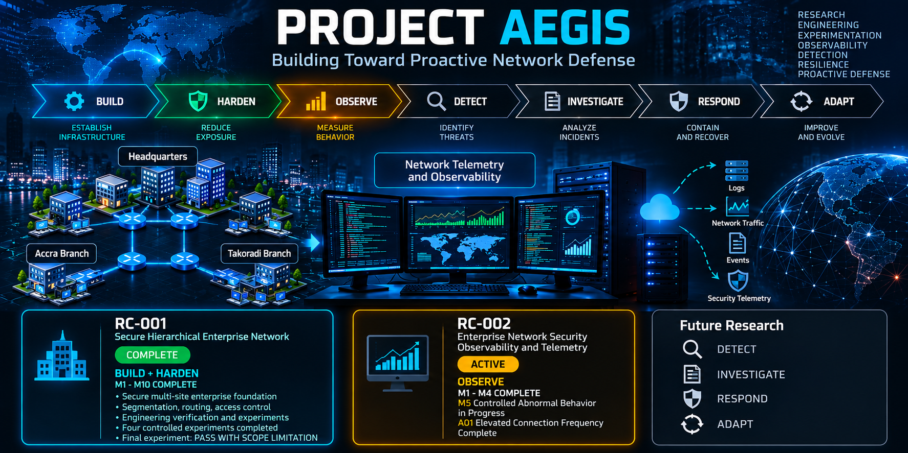

# Project Aegis

> **Building Toward Proactive Network Defense**



Project Aegis is a developing **research and engineering portfolio** investigating how enterprise networks can evolve from secure infrastructure toward increasingly **observable, measurable, resilient, and proactive cyber defense**.

The portfolio combines network engineering, security architecture, controlled experimentation, network telemetry, detection engineering, investigation, response, and defensive automation.

Rather than presenting isolated technical labs, Project Aegis is structured as a connected research journey:

**BUILD -> HARDEN -> OBSERVE -> DETECT -> INVESTIGATE -> RESPOND -> ADAPT**

Each research case contributes evidence, engineering lessons, and experimental findings that inform subsequent stages of the portfolio.

---

## Research Motivation

Modern cyber defense requires more than establishing connectivity and applying perimeter controls.

Enterprise networks must be designed securely, instrumented effectively, measured systematically, and evaluated under controlled conditions before increasingly advanced defensive mechanisms can be investigated responsibly.

Project Aegis therefore explores the broader research question:

> **How can enterprise networks be designed, instrumented, measured, and progressively defended to improve visibility into network behavior and support increasingly effective detection, investigation, and response?**

The portfolio approaches this question progressively rather than assuming that advanced defensive capabilities already exist.

---

## Research and Engineering Philosophy

Project Aegis is guided by five principles.

### Research-Driven

Projects are organized around clearly defined engineering or research questions rather than tool demonstrations alone.

### Measurable

Where practical, implementations are evaluated using observable evidence, packet captures, logs, metrics, verification tests, and controlled experiments.

### Reproducible

Architectures, configurations, methodology, assumptions, datasets, results, and limitations are documented so that the work can be reviewed and reproduced.

### Transparent

Successful outcomes, failures, troubleshooting decisions, scope limitations, and unexpected observations are documented rather than hidden.

### Progressive

Each research case contributes to a broader progression from secure network infrastructure toward increasingly observable and proactive defensive systems.

---

# Current Portfolio State

Project Aegis has progressed from establishing and hardening an enterprise network foundation into the study of network observability and measurable behavior.

```text
Project Aegis

BUILD -> HARDEN -> OBSERVE -> DETECT -> INVESTIGATE -> RESPOND -> ADAPT
   |         |          |
   +---- RC-001 --------+
                        |
                     RC-002
                      ACTIVE
```

Current progression:

- **RC-001 - Secure Hierarchical Enterprise Network**
  - Status: COMPLETE
  - Primary contribution: BUILD + HARDEN
  - M1-M10 complete
  - Secure multi-site enterprise foundation established and verified
  - Controlled engineering experiments completed
  - Scalability experiment concluded with a documented scope limitation

- **RC-002 - Enterprise Network Security Observability and Telemetry**
  - Status: ACTIVE
  - Primary contribution: OBSERVE
  - M1-M4 complete
  - M5 controlled abnormal-behavior experimentation in progress
  - A01 elevated connection-frequency experiment complete

Later DETECT, INVESTIGATE, RESPOND, and ADAPT stages remain research directions rather than completed Project Aegis capabilities.

---

# Research Cases

## RC-001 - Secure Hierarchical Enterprise Network

**Status: COMPLETE**

**Project Aegis contribution: BUILD + HARDEN**

RC-001 establishes the secure enterprise-network foundation on which subsequent Project Aegis research is built.

The research case investigates how a multi-site enterprise network can be designed, progressively hardened, and systematically validated while preserving required business connectivity.

### Environment

RC-001 models an enterprise environment containing:

- Headquarters
- Accra Branch
- Takoradi Branch
- Segmented user, server, and management networks
- Multi-site routing and controlled inter-network communication

### Engineering Capabilities

The project implements and validates:

- Hierarchical multi-site network architecture
- Structured IPv4 addressing
- VLAN-based segmentation
- IEEE 802.1Q trunking
- Inter-VLAN routing
- Multi-site OSPF dynamic routing
- Dedicated infrastructure-management networks
- SSHv2 administrative hardening
- Extended ACL-based security segmentation
- Positive and negative security testing
- Web and DNS services
- Structured verification and engineering documentation
- Controlled network experiments
- Version-controlled Packet Tracer environments

### Experimental Contribution

RC-001 progressed beyond configuration into controlled verification and experimentation.

The experiments examined network behavior under defined conditions, including routing behavior, access-control enforcement, and scalability-related change.

The final scalability experiment demonstrated successful departmental expansion while also documenting that the originally intended future-branch expansion condition was not fully implemented.

Accordingly, that experiment was classified:

**PASS WITH SCOPE LIMITATION**

This distinction is retained deliberately as part of the project's research-integrity approach.

### Repository

[**RC-001 - Secure Hierarchical Enterprise Network**](https://github.com/Emmanuel-Ampong/RC-001-Hierarchical-Enterprise-Network)

The dedicated repository contains architecture documentation, requirements, implementation records, verification reports, experimental evidence, engineering logs, troubleshooting records, and the Packet Tracer environment.

---

## RC-002 - Enterprise Network Security Observability and Telemetry

**Status: ACTIVE**

**Project Aegis contribution: OBSERVE**

RC-002 extends the validated engineering foundation established in RC-001 into network observability and experimental measurement.

The project investigates:

> **To what extent can centralized network telemetry improve the observability of normal and abnormal behavior within a segmented multi-site enterprise network while preserving legitimate network operations?**

### Research Objectives

RC-002 is designed to investigate whether a controlled enterprise environment can:

- Centralize selected network telemetry
- Characterize legitimate network behavior
- Establish reproducible baseline measurements
- Introduce controlled abnormal conditions
- Measure differences between baseline and controlled abnormal conditions
- Preserve legitimate network operations while observability mechanisms are introduced
- Produce structured evidence suitable for later detection-oriented research

### Laboratory Stack

The current research environment uses:

- GNS3
- FRRouting
- Ubuntu Server
- Alpine Linux
- rsyslog
- Wireshark and tcpdump
- Lightweight virtual endpoints
- Structured datasets and experimental records

The environment is intentionally lightweight so that the research remains appropriate to the available laboratory resources and the objectives of the OBSERVE phase.

### Current Experimental Progress

Completed milestones include:

```text
M1 - GNS3 Laboratory Environment                 COMPLETE
M2 - Minimum Observability Topology              COMPLETE
M3 - Telemetry Collection Foundation             COMPLETE
M4 - Normal Traffic Baseline                     COMPLETE
M5 - Controlled Abnormal Behavior                IN PROGRESS
     |
     +-- A01 Elevated Connection Frequency       COMPLETE
     +-- A02 Destination/Service Diversity       NEXT
```

M4 established quantitative normal-operation references for selected ICMP, HTTP, Internet-connectivity, and system-event behavior.

A01 then introduced a controlled increase in HTTP connection frequency. The experiment produced a reproducible measurable difference from the corresponding normal reference while legitimate HTTP service remained operational.

This result is treated as **scenario-specific evidence of behavioral differentiation**. It is not presented as proof of malicious activity, automated anomaly detection, or threat detection.

### Repository

[**RC-002 - Enterprise Network Security Observability and Telemetry**](https://github.com/Emmanuel-Ampong/RC-002-Enterprise-Network-Security-Observability)

Detailed milestone documentation, methodology, datasets, evidence, results, limitations, and experimental records are maintained in the dedicated RC-002 repository.

---

# Aegis Research Trajectory

## 1 - BUILD

Establish reproducible and scalable enterprise-network infrastructure.

Primary work includes:

- Network architecture
- Addressing
- Routing
- Segmentation
- Enterprise services
- Verification

**Current evidence base: RC-001**

---

## 2 - HARDEN

Progressively reduce unnecessary exposure while preserving legitimate operations.

Research areas include:

- Security segmentation
- Access control
- Administrative security
- Management-plane protection
- Attack-surface reduction
- Security-control verification

**Current evidence base: RC-001**

---

## 3 - OBSERVE

Develop the ability to measure what occurs within the network.

Research areas include:

- Centralized logging
- Network telemetry
- Packet-level evidence
- Traffic characterization
- Behavioral baselines
- Controlled abnormal-behavior experiments
- Quantitative comparison

**Current research case: RC-002**

---

## 4 - DETECT

Future work is expected to investigate whether observable network behavior can support reliable detection mechanisms.

Potential research areas include:

- IDS/IPS
- Detection engineering
- Threat hypotheses
- Behavioral detection
- Alert logic
- Detection-performance evaluation
- False-positive and false-negative analysis

This stage is not yet presented as a completed Project Aegis capability.

---

## 5 - INVESTIGATE

Future research may examine how collected telemetry and detection evidence can support:

- Threat hunting
- Incident reconstruction
- Event correlation
- Root-cause analysis
- Evidence-driven investigation

This stage remains a research direction.

---

## 6 - RESPOND

Future work may investigate:

- Incident-response workflows
- Containment
- Recovery
- Defensive automation
- Response-time measurement
- Detection-informed response

This stage remains a research direction.

---

## 7 - ADAPT

Longer-term research may investigate how telemetry, detection, investigation, and response can contribute to increasingly adaptive defensive systems.

Potential questions include whether defensive policies can be adjusted using measured evidence while maintaining acceptable operational reliability.

This stage represents a long-term research direction rather than a completed capability.

---

# Research Roadmap

Project Aegis is a **multi-project research portfolio** rather than a fixed collection of unrelated labs.

Potential research areas include:

| Research Area | Direction |
| --- | --- |
| Secure Infrastructure | Enterprise network architecture and hardening |
| Access Control | Segmentation and policy enforcement |
| Identity and AAA | Centralized administrative security |
| Telemetry | Network and security visibility |
| Behavioral Analysis | Network baseline characterization |
| IDS/IPS | Signature-based threat detection |
| Detection Engineering | Evidence-driven detection development |
| Adversary Simulation | Controlled detection validation |
| Anomaly Detection | Investigation of behavioral deviation |
| Detection Evaluation | Measurement of detection performance |
| Threat Hunting | Evidence-driven investigation |
| Incident Analysis | Reconstruction and correlation |
| Response Automation | Controlled defensive response |
| Adaptive Defense | Detection-informed defensive adaptation |
| Integration | End-to-end proactive network-defense research |

The roadmap is intentionally flexible. Findings and limitations from earlier research cases may influence the design of later work.

---

# Research Integrity

Project Aegis distinguishes carefully between work that is:

- **planned**
- **configured**
- **operational**
- **tested**
- **verified**
- **experimentally observed**

A configuration being operational does not automatically establish that it is secure.

A measurable behavioral difference does not automatically establish that an event is malicious.

An observable deviation does not automatically constitute anomaly detection.

A successful controlled experiment does not automatically generalize beyond the conditions under which it was performed.

Experimental limitations, unexpected outcomes, negative results, and scope restrictions are documented explicitly.

Claims involving advanced capabilities such as automated threat detection, zero-day detection, intelligent response, or adaptive defense will only be made if later Project Aegis research produces evidence sufficient to support them.

---

# Documentation Philosophy

Each research case is expected, where appropriate, to progressively include:

- Research or engineering question
- Requirements
- High-Level Design
- Low-Level Design
- Architecture Decision Records
- Implementation documentation
- Experimental methodology
- Verification procedures
- Evidence
- Datasets
- Results and analysis
- Troubleshooting records
- Engineering logs
- Limitations
- Lessons learned
- Future work
- Requirements traceability
- Version history

This structure is intended to make the portfolio reviewable as engineering work and increasingly rigorous as research.

---

# Current Status

```text
PROJECT AEGIS

RC-001 - Secure Hierarchical Enterprise Network
|
+-- BUILD                                      COMPLETE
+-- HARDEN                                     COMPLETE
+-- M1-M10                                     COMPLETE
+-- Final status                               COMPLETE
|
v
RC-002 - Enterprise Network Security Observability and Telemetry
|
+-- OBSERVE                                    ACTIVE
+-- M1-M4                                      COMPLETE
+-- M5 Controlled Abnormal Behavior            IN PROGRESS
|   |
|   +-- A01 Elevated Connection Frequency      COMPLETE
|   +-- A02 Destination/Service Diversity      NEXT
|
v
Future Research
|
+-- DETECT
+-- INVESTIGATE
+-- RESPOND
+-- ADAPT
```

Project Aegis therefore currently sits primarily in the **OBSERVE** phase.

---

## Guiding Principle

> **Build deliberately. Test systematically. Measure objectively. Document transparently. Defend proactively.**

---

## Author

**Emmanuel Ampong**

Research interests include:

- Network Security
- Enterprise Networking
- Secure Infrastructure
- Network Observability
- Detection Engineering
- Threat Detection and Response
- Network Analytics
- Security Automation
- Proactive Cyber Defense
- AI-Assisted Cyber Defense

---

**Project Aegis is a portfolio in development. Future research cases and research directions will evolve as experimentation produces new findings.**
